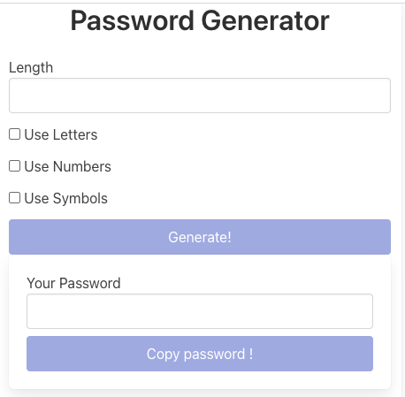

# PaswwordGenerator

This project was generated with [Angular CLI](https://github.com/angular/angular-cli) version 15.1.1.

## Development server

Run `ng serve` for a dev server. Navigate to `http://localhost:4200/`. The application will automatically reload if you change any of the source files.

## Clone Repo and run "npm i"

## Simple Password Generator

